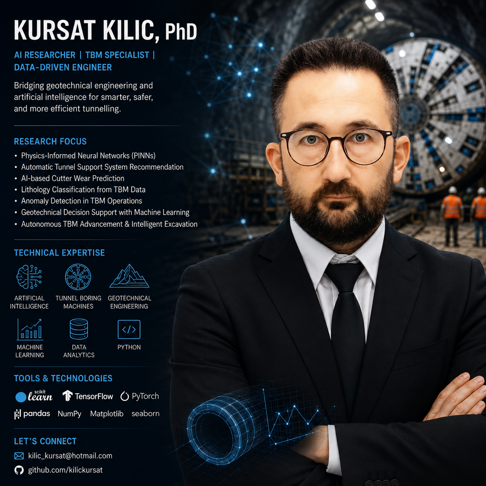

# Kursat Kilic, PhD

### AI Researcher | TBM Specialist | Geotechnical Data Scientist | Machine Learning Engineer

Advancing underground construction through Artificial Intelligence, Physics-Informed Neural Networks, and Data-Driven Geomechanics.

# Kursat Kilic, PhD

## AI Researcher | Tunnel Boring Machine (TBM) Specialist | Geotechnical AI Scientist | Machine Learning Engineer

I am a researcher and engineer focused on the intersection of **artificial intelligence, machine learning, geotechnical engineering, and tunnel boring machine (TBM) technology**. My work centers on developing data-driven solutions that improve tunneling performance, operational efficiency, predictive maintenance, and underground construction decision-making.

With a strong background in **TBM mechanics, rock cutting processes, geomechanics, and data analytics**, I investigate how advanced machine learning techniques can transform traditional tunneling practices into intelligent, autonomous, and adaptive systems.

## Research Interests

My primary research areas include:

* Artificial Intelligence for Tunnel Boring Machines (TBMs)
* Machine Learning in Geotechnical and Underground Engineering
* Cutter Wear Prediction and Predictive Maintenance
* Lithology and Ground Condition Identification
* Autonomous TBM Operation and Navigation
* Digital Tunneling and Smart Construction Technologies
* Data-Driven Rock Mechanics and Geomechanics
* Predictive Analytics for Tunnel Performance Optimization
* Explainable AI for Engineering Applications
* Deep Learning for Underground Infrastructure Projects

## Current Focus

I am actively developing and evaluating advanced **Physics-Informed Neural Networks (PINNs)** and **AI-powered tunnel support recommendation systems** to enhance tunnelling operations, geotechnical engineering analysis, and underground construction decision-making. My research focuses on integrating engineering principles, field data, and machine learning to create intelligent, explainable, and reliable solutions for complex subsurface environments.

Current research and development projects include:

* Physics-Informed Neural Networks for geotechnical and tunnelling applications
* Automated tunnel support system recommendation using machine learning and engineering knowledge
* AI-based cutter wear prediction and maintenance optimization
* Automated lithology and ground condition classification using TBM operational data
* Feature engineering and predictive analytics for tunnelling performance datasets
* Anomaly detection and operational risk assessment in TBM excavation processes
* Machine learning frameworks for geotechnical decision support and digital tunnelling
* Intelligent excavation systems and autonomous TBM advancement technologies
* Data-driven geomechanics and rock mass characterization
* Explainable AI applications for underground construction and infrastructure projects

## Technical Skills

### Programming and Data Science

* Python
* Data Analysis and Statistical Modeling
* Scientific Computing
* Large Language Models
* Vision Language Models

### Machine Learning and Artificial Intelligence

* Scikit-learn
* TensorFlow
* PyTorch
* Supervised Learning
* Unsupervised Learning
* Deep Learning
* Predictive Modeling

### Data Analytics and Visualization

* Pandas
* NumPy
* Matplotlib
* Seaborn

### Engineering Expertise

* Tunnel Boring Machines (TBMs)
* Geotechnical Engineering
* Rock Mechanics
* Rock Cutting Processes
* Underground Construction
* Tunneling Engineering
* Geomechanics
* Ground Characterization

## Collaboration Opportunities

I welcome collaboration opportunities with researchers, universities, engineering consultants, contractors, equipment manufacturers, and technology companies working in:

* Artificial Intelligence for Civil Engineering
* Tunnel Boring Machine Research and Development
* Smart Tunneling and Digital Construction
* Geotechnical Data Analytics
* Machine Learning Applications in Infrastructure
* Autonomous Construction Systems
* Underground Space Engineering

## Contact

Email: [kilic_kursat@hotmail.com](mailto:kilic_kursat@hotmail.com)

GitHub: https://github.com/kilickursat

## Mission

Advancing the future of underground construction by integrating artificial intelligence, machine learning, and geotechnical engineering to create safer, smarter, and more efficient tunneling systems.
